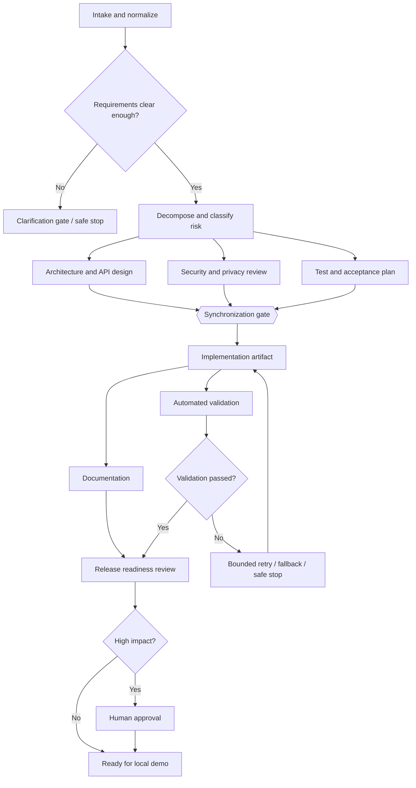

# Agentic URL Shortener Prototype — Build Plan

## Objective

Build a runnable local URL shortener and a governed orchestration prototype that turns a natural-language engineering request into a traceable, reviewable delivery. The demo should show requirement normalization, dependency-aware planning, parallel and sequential work, validation, approvals, safe failure handling, and release readiness. Human reviewers remain accountable for high-impact changes and final quality.

The prototype will favor a small, inspectable system over a distributed production deployment. It will run locally with SQLite and deterministic agent implementations, while defining an adapter boundary for future LLM-backed agents. This keeps the demo repeatable, avoids API-key requirements, and makes policy and orchestration behavior testable.

## Proposed stack and executable shape

- **Python 3.12**, FastAPI, Pydantic, SQLAlchemy (or a small SQLite repository layer), pytest, and HTTPX.
- **SQLite** for local persistence; schema and migration strategy documented so PostgreSQL can replace it.
- **Typer CLI** for running the API, orchestration scenarios, and inspection commands.
- **Docker Compose** as an optional one-command run path; direct `uv`/pip setup also supported.
- **No external LLM required.** Requirement parsing and stage agents use deterministic implementations and structured inputs. A provider interface can later connect approved model APIs without coupling the workflow engine to one vendor.

Primary run paths:

```bash
uv sync
uv run uvicorn app.main:app --reload
uv run pytest
uv run python -m app.cli demo greenfield
```

The API will expose `/health`, `/api/links` (create, resolve, list), `/api/links/{code}/analytics`, `/api/runs` (start/inspect a workflow run), `/api/runs/{run_id}/approve`, and `/api/runs/{run_id}/events`. OpenAPI docs come from FastAPI. Exact request/response shapes are defined before implementation and captured in the README/API docs.

## What will be built

### URL shortener service

- Create a short link from an absolute HTTP(S) URL; reject unsafe schemes and malformed input.
- Allow an optional custom alias subject to a strict character/length policy and uniqueness constraint.
- Resolve a code to its destination and record a click event; support optional expiry and disabled links.
- Provide per-link analytics: total clicks and time-bucketed counts, with documented attribution limits.
- Use stable error responses, input validation, structured logs, and database constraints for correctness under concurrency.
- Keep analytics collection privacy-minimal: no raw IP or user-agent persistence by default. Document retention and production privacy decisions as unresolved deployment policy.

### Orchestration engine

Represent a workflow run as a persisted DAG of stage executions, not a hard-coded chain. Each node has declared inputs, outputs, dependencies, retry policy, timeout, risk tier, and entry/exit conditions. The engine will support:

- **Stages:** requirement intake/normalization, ambiguity and risk review, task decomposition, architecture/design, implementation proposal, test/validation, documentation, release readiness.
- **Parallel paths:** design review and security review can run after normalized requirements; test planning and API contract review can run in parallel after design. A synchronization gate waits for required branches before implementation/release decisions.
- **Stateful execution:** run state, stage attempts, structured outputs, input/output hashes, parent references, approvals, and append-only audit events persist in SQLite. A stage consumes versioned upstream outputs, making changed assumptions visible.
- **Re-planning:** when an upstream artifact changes, mark dependent stages stale, preserve prior attempts, recompute the affected subgraph, and require human review again when risk/impact warrants it.
- **Governance:** policy checks prohibit secret exposure, unsafe URL schemes, unreviewed schema/data-loss operations, and direct production deployment. High-impact actions pause in `awaiting_approval`; low-risk analysis and local validation may proceed automatically. Approval records identify actor, decision, rationale, and the exact artifact version approved.
- **Reliability controls:** bounded retries with backoff for transient stage failures, explicit fallback to a deterministic/manual stage, idempotency keys, safe-stop on policy or repeated failure, and rollback as a generated compensating-action plan (not an automatic destructive database rollback).
- **Observability:** run/stage status, event timeline, token/cost fields where a provider supplies them, duration, retries, fallbacks, blocked/approval time, and failure/rollback counts. Report success rate, retry rate, rollback rate, mean time to recovery, and end-to-end latency with the measurement window and denominator shown.

Agent stages produce typed artifacts and rationale. The orchestrator owns scheduling and policy enforcement; an agent cannot approve its own high-impact output or directly perform an unreviewed release action.

### Demonstration scenarios

1. **Greenfield:** “Add expiring short links and click analytics.” Normalize assumptions, generate a dependency graph, run independent design/security and test-planning stages in parallel, synthesize implementation/API/test/documentation artifacts, validate acceptance criteria, then pause at release approval.
2. **Brownfield:** Seed a small existing URL-shortener baseline in the demo fixture and request a change such as alias support. Show repository/module impact analysis, migration/API compatibility checks, targeted test plan, affected-node re-planning, and approval before a schema-affecting change.
3. **Ambiguous:** “Make links safer and more useful.” Identify unresolved scope (abuse controls, privacy, expiry, analytics granularity), propose explicit alternatives and risks, proceed only with reversible low-risk analysis, then stop at a clarification/approval gate rather than inventing consequential requirements.

Each scenario will emit a readable run summary and machine-readable JSON containing normalized requirements, DAG, artifacts, validation results, decision lineage, approvals, and reliability metrics. Scenario outputs are demo artifacts, not claims that an autonomous coding agent has safely modified arbitrary repositories.

## Folder structure

```text
.
├── app/
│   ├── main.py                    # FastAPI app and lifecycle
│   ├── cli.py                     # run/demo/inspect commands
│   ├── config.py                  # settings and safe defaults
│   ├── api/                        # routes, schemas, error mapping
│   ├── shortener/                  # domain rules, service, repository
│   ├── analytics/                  # event collection and aggregations
│   ├── orchestration/
│   │   ├── graph.py                # DAG definitions and validation
│   │   ├── engine.py               # scheduling, gates, sync, re-plan
│   │   ├── models.py               # run/stage/event state types
│   │   ├── policy.py               # risk tiers and guardrails
│   │   ├── approvals.py            # approval checkpoints
│   │   ├── reliability.py          # retry/fallback/stop/rollback plans
│   │   ├── metrics.py              # run and reliability metrics
│   │   └── agents/                 # typed stage interfaces and local agents
│   ├── storage/                    # database setup, models, migrations
│   └── observability/              # structured logs and trace/event helpers
├── scenarios/
│   ├── greenfield.yaml
│   ├── brownfield.yaml
│   └── ambiguous.yaml
├── tests/
│   ├── unit/                       # domain, policy, graph, retry behavior
│   ├── integration/                # API + database flows
│   └── scenarios/                  # expected scenario gates/artifacts
├── docs/
│   ├── architecture.md
│   ├── api.md
│   ├── threat-model.md
│   ├── decisions/                  # concise ADRs
│   └── demo-script.md
├── scripts/                        # seed/reset/demo helpers
├── Dockerfile
├── compose.yaml
├── pyproject.toml
├── .env.example
└── README.md
```

## Dependency graph and execution outline



All edges and gates are data-defined and validated for acyclicity at load time. The execution log records why a node ran, waited, retried, was invalidated, or stopped.

## Build sequence and checkpoints

1. **Clarify and baseline:** turn the brief into acceptance criteria and a short assumptions/risk register; define API contracts and scenario inputs.
2. **Service foundation:** establish package, settings, SQLite persistence, URL validation, create/resolve APIs, and domain tests.
3. **Analytics and service hardening:** click events, aggregation endpoint, expiry/disabled behavior, stable errors, and integration coverage.
4. **Orchestration core:** typed DAG, graph validation, persisted state/event lineage, gates, synchronization, and deterministic stage runner.
5. **Governance and recovery:** policy decisions, approval endpoint, bounded retry/backoff, fallback, safe stop, stale-stage invalidation, and compensating rollback plans.
6. **Scenarios and output generation:** encode the three scenarios, produce reviewable structured engineering artifacts, and show the approval/safe-stop paths.
7. **Release readiness:** docs, container/local setup, threat model, demo script, metrics explanation, and end-to-end manual walkthrough; run the automated test suite and fix failures.

Exit gates: service contract tests pass before orchestration integration; graph and policy invariants pass before scenario execution; all three scenarios produce expected terminal/gated states before calling the prototype complete. Human review remains required for generated implementation proposals and release readiness.

## Validation and risk controls

- Unit tests cover URL normalization/scheme rejection, alias uniqueness, expiry, analytics aggregation, DAG ordering/cycle rejection, policy decisions, approval version matching, stale descendant invalidation, retry bounds, and safe-stop behavior.
- API integration tests cover create/resolve/click, invalid inputs, expiry, analytics, and workflow run/approval/events.
- Scenario tests assert meaningful properties (parallel stages can both become ready; approval blocks high-impact completion; ambiguity stops for clarification; re-planning preserves lineage), rather than brittle exact prose.
- Security checks include strict HTTP(S)-only targets, no fetch-on-create (avoids SSRF), safe redirect response handling, alias enumeration/rate-limit risks documented, parameterized persistence, no secrets in logs/artifacts, and policy tests for protected actions.
- Operational limits: SQLite is for a single-process prototype; the local scheduler is not a distributed queue; click counts are best-effort and may be duplicated under retries unless event idempotency is applied; deterministic agents demonstrate orchestration semantics rather than general intelligence.

## Key decisions and trade-offs

- **Local deterministic agents first:** reliable, reviewable demos and repeatable tests; less semantic flexibility than a live model. A provider adapter can be added later with explicit cost, data-handling, and prompt-injection controls.
- **SQLite before managed database:** simpler setup; does not demonstrate horizontal scale or multi-writer production behavior.
- **Approval as persisted workflow state:** clear human ownership; slows high-impact runs by design.
- **Compensating rollback plans rather than auto-rollback:** prevents unsafe reversal where data loss or external side effects are possible; an operator must execute and review the plan.
- **No autonomous deployment:** release readiness produces a checklist/artifact and an approval gate, keeping deployment outside prototype autonomy boundaries.

## Completion definition

The work is complete when a new user can follow the README to start the service, exercise shortening and analytics over HTTP, run all three scenarios from the CLI, inspect their event/artifact/approval history, and run the test suite successfully. The architecture and risk documentation must explain what is simulated, what is enforced, and what remains a production deployment concern.

## Implementation notes

The prototype uses direct `sqlite3` and Python's `argparse` CLI instead of SQLAlchemy and Typer. This keeps the local runtime small and makes the persistence and command behavior easy to inspect. It uses a `ThreadPoolExecutor` for independent stages, FastAPI/Uvicorn for HTTP, and includes pytest/HTTPX development dependencies. The repository README documents the implemented interface and setup.
